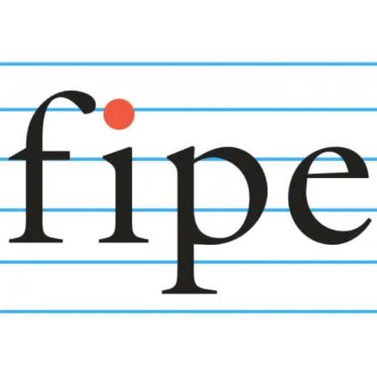

# Link Vercel Fipe-2024

[Demo](#)



## Rodar o Projeto FIPE-NEXTJS-2024

First, install dependencies:

```bash
yarn
```

Run the development server:

```bash
yarn dev
```

Open [http://localhost:3000](http://localhost:3000) with your browser to see the result.

Test with

```bash
yarn test
```

## Tecnologias Utilizadas

- NextJS
- React
- eslint
- lint-staged
- husky
- typescript
- editorconfig
- prettier
- Styled-components
- Context API
- Material UI
- Theming
- axios-mock-adapter
